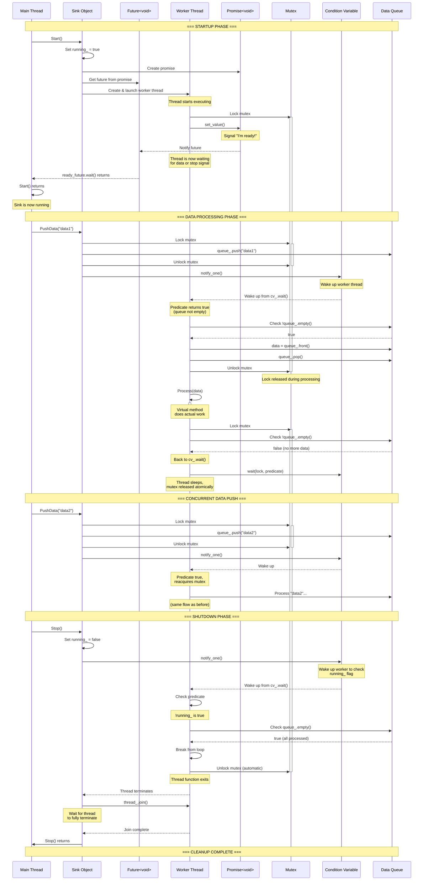
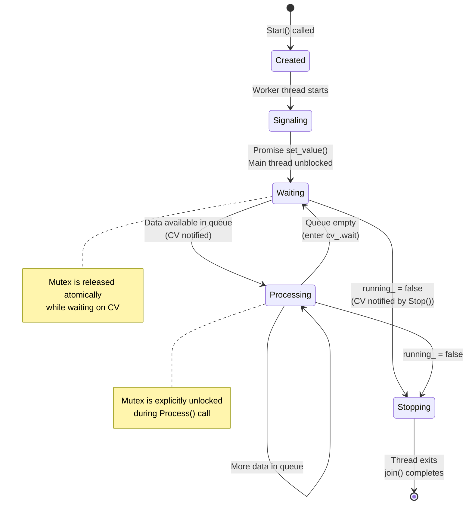

# Sink

The sink is a base class for a piece of the dsp chain that does not emit any values. It consumes values using the
observer pattern and does something with them, but it will not be an observable, only an observer. Most common use cases
will be to write data into a file or to send it to the gui for displaying.

## Lifecycle

### Worker Thread State Machine

